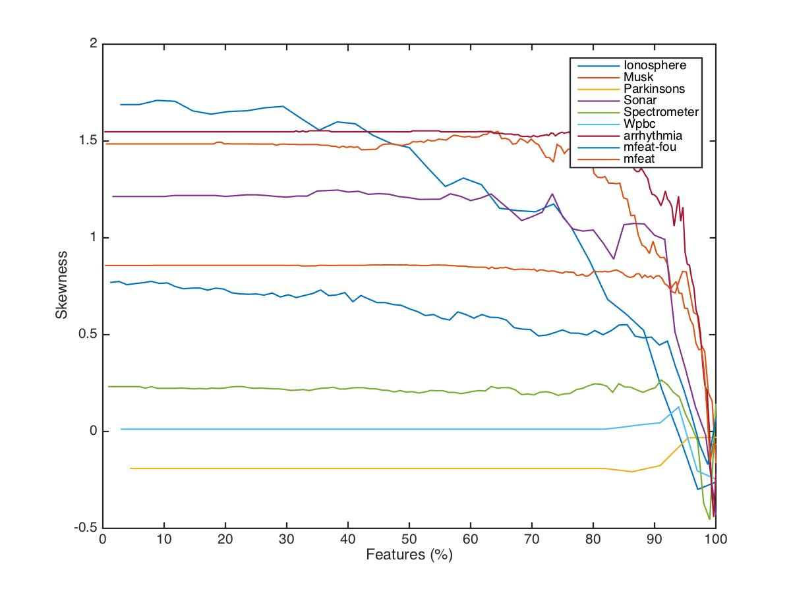

# 面向高维数据的PCA-Hubness聚类方法

郎江涛

（重庆大学计算机学院，重庆，400044）

**摘要：**

维度灾难（Curse of Dimensionality）在各个领域为各种机器学习的方法和任务带来了诸多挑战。在高维空间中，由于数据的稀疏性以及数据点之间的易区分的距离的难度增加，从而导致聚类变得异常困难。因此本文，我们对高维数据的聚类问题采取新的观点。利用高维数据的内在特性，更具体地说，将hubness ——— 高维数据倾向于或者易于包含某些频繁出现在其它点的k近邻列表中的点（Hubs）——— 结合PCA降维算法应用到聚类中。在高维数据聚类过程中，hubness可视为一种有效的方法用于检测点的中心性（Point Centrality）。而PCA主要用于减少特征数，减少噪音和冗余，减少过度拟合的可能性。本文通过hubness这一高维数据的内在特性，对PCA的降维程度进行了较为适宜的调控，从而提高了聚类效果。

**关键字：**

聚类；高维数据；Hubness；PCA

# 0 引言

​	通常在无监督学习过程中，聚类是将元素分成不同的组别或者更多的子集，使得分配到相同簇中的元素彼此之间比其它的数据点更为相似，也就是说，要增加类内的相似性并减小类间的相似性，然而该目标的实现过程中却有诸多障碍。多年来，已提出多种聚类算法，可以大致分为以下四类：partitional， hierarchical，density- based 和 subspace 算法。其中 subspace 算法是在原始数据的低维投影中进行聚类，当原始数据为高维时此方法更为适宜。之所以选择 subspace算法是因为在实验过程中观测到：随着数据维度的增大，维度灾难出现的概率也随之增大，而这一性质使得诸多标准的机器学习算法表现不佳。此问题主要由以下两个因素引起的：空的空间现象（Empty Space Phenomenon）和距离集中（Concentration Of Distances）。前者指的是当维数提高时，空间的体积提高太快，因而可用数据变得很稀疏。[^1] 后者是说高维数据空间表示出现了某种程度上的反直觉的特性 ——— 随着维度增加，数据点之间的所有距离趋向于变得更加难以区分，这可能会导致基于距离的算法性能变差。[^2]  

​	“维数灾难”通常是用来作为不要处理高维数据的无力借口。由于本征维度（Intrinsic Dimensionality）的存在，其概念是指任意低维数据空间可简单地通过增加空余（如复制）或随机维将其转换至更高维空间中，相反地，许多高维空间中的数据集也可削减至低维空间数据，而不必丢失重要信息。这一点也通过众多降维方法的有效 性反映出来，如应用广泛的主成分分析（PCA）方法。针对距离函数和最近邻搜索，当前的研究也表明除非其中存在太多不相关的维度，带有维数灾难特色的数据集依然可以处理，因为相关维度实际上可使得许多问题（如聚类分析）变得更加容易。在本文中，我们阐述了hubness——— 高维数据倾向于或者易于包含某些频繁出现在其它点的k近邻列表中的点（hubs），并将其应用到聚类中。探讨了k-occurrences的偏度与本征维度的相互关系。

# 1 相关工作

​	近年来在涉及声音和图像数据的若干应用领域中观察到 hubness 现象（Aucouturier and Pachet, 2007; Doddington et al., 1998; Hicklin et al., 2005）， 此外，Jebara 等人简要地描述了在半监督学习的邻域图构造过程中出现的hubness 现象（Tony Jebara et al 2009）[^3]。Amina M 等人通过将 hub 引入到 k-means 算法中从而形成了基于 hubness 的算法（Amina M et al 2015）[^4]。尽管在数据聚类中 hubness 这一现象并没有给予过多关注，然而 k-nearest-neighbor 列表却广泛使用在诸多聚类中。k-nearest-neighbor 列表通过用于观察由 k 个最近邻所确定的空间的体积来计算密度估计。基于密度的聚类方法通常依赖于这种密度估计。基于密度的聚类算法主要的目标是寻找被低密度区域分离的高密度区域[^5]。在高维空间中，这常常难以估计，因为数据非常稀疏。 此外，选择适当的邻域大小也尤为重要，因为过小和过大的 k 值都可能导致基于密度的方法失败。k-nearest-neighbor 列表常被用于构造 k-NN 图并以此用于图聚类。

## 1.1 Hubness 现象

​	令 $D ⊂ R^d，d\in\{1,2,…\}$ 表示一组数据点，其中 $x_1,x_2,…x_n$ 为数据集 $D$ 的元素。令 $dist$ 表示在 $R^d$ 空间中的一个距离函数 $p_{i,k}$，其中 $i, k \in \{1,2,…,n\}$ 如下定义：

​						$$p_{i,k}=\begin{cases} 1, & \text{if $x$ is among k nearest neighbours of $x_i$, according to $dist$} \\0  & \text{otherwise} \end{cases}$$

​	在此基础之上，定义 $N_k(x)=\sum_{i=1}^np_{i,k}(x)$，$N_k(x)$ 表示为在 $R^d$ 空间中，$x$ 出现在其它 k-nearest neighbor 列表中的次数，也记为 K-occurrence，仅根据数据点的 K-occurrence 的大小无法确定 hubness 对实验结果有何种影响。 数据点的 bad k-occurrences 表示为 $B_{N_K (x)}$，是指数据点 x 作为数据集 D 中其它的点的 k-nearest neighbor次数，并且 x 点的标签和那些点的标签不匹配。数据点的 good k-occurrences 表示为 $G_{N_K(x)}$， 是指点 x 的标签与那些点的标签相匹配。为了表征 $N_k$ 的非对称性，我们使用 k-occurrences 分布的标准第三矩，

​										$$S_{N_k}=\frac{E(N_k-\mu_{N_k})^3}{\sigma_{N_k}^3}$$

其中 $\mu_{N_k}$ 和 $\sigma_{N_k}$ 分别是 $N_k$ 的均值和标准差。

​	一方面，虽然高维数据已表现出hubness这一现象，然而它的偏度（skewness） 和分布却因数据的不同而差异颇大。因此，hubs甚至有时可以在被检索时被视为噪声。另一方面， hubness与距离集中现象密切相关 ———  一种与高维数据的反直觉特性（随着维度增加数据点之间的所有距离趋向于变得更加难以区分）[^6]。

## 1.2 基于hub的聚类

​	更接近簇均值的点易倾向于具有比其它点更高的 hubness 分数[^9]。将 hubness 视为一种局部中心度量，则可以以各种方式使用 hubness 进行聚类。基于hub的聚类算法主要有以下4种： deterministic, probabilistic, hybrid 和 kernel。这4种方法均为 k-means 算法的扩展。在 deterministic 方法中，首先确定簇的数量然后使用 k-means 算法进行聚类，在每次聚类的过程中将当前簇中的具有高的 hubness 分数的点作为其中心。Probabilistic 方法使用模拟退火算法以一定概率$\theta(=min(1, t/N Prob))$ 选择高 hubness 分数的点作为当前簇的中心。Deterministic 和 probabilistic 方法只依赖于距离矩阵而不必关心数据的表现形式。为了尽可能地获取数据的中心位置则需要使用 hybrid 方法。在 hybrid 方法中，使用数据点的 hubness 分数来指导搜索，但最终会形成基于质心的簇结构。kernel 方法在前三者基础上可以对非超球面簇集进行处理。基于 hub 的聚类算法用于高维数据，由此可见随着维度的增加聚类时间和迭代次数也随之增加。

# 2 PCA-Hubness

​	主成分分析（Principal components analysis，PCA）经常用于减少数据集的维数，同时保持数据集中的对方差贡献最大的特征。这是通过保留低阶主成分，忽略高阶主成分做到的。这样低阶成分往往能够保留住数据的最重要方面[^10]。主成分分析主要是通过对协方差矩阵进行特征分解，以得出数据的主成分（即特征向量）与它们的权值（即特征值）。这可以理解为对原数据中的方差做出解释：哪一个方向上的数据值对方差的影响最大？换而言之，PCA 提供了一种降低数据维度的有效办法；如果分析者在原数据中除掉最小的特征值所对应的成分，那么所得的低维度数据必定是最优化的（也即，这样降低维度必定是失去讯息最少的方法）。

​	通过使用降维来保存大部分数据信息的主成分分析的观点是不正确的。确实如此，当没有任何假设信息的信号模型时，主成分分析在降维的同时并不能保证信息的不丢失，其中信息是由香农熵来衡量的。 因此，下文中将会探讨在使用降维技术 PCA 的情况下 $N_k$ 的偏度和本征维度的相互作用。此研究的主要目的在于探讨降维是否能够缓解 $N_k$ 的偏度这一问题。因为观察到的 $N_k$的偏度与与本征维数强烈相关。【】此外，本征维数对 $N_k$ 到数据集的均值或者与最接近簇的均值的距离有着积极影响，这意味着在较高（本征）维度中，hubs 变得越来越接近数据集或最接近簇的中心。

> 详细说明 的 $N_k$的偏度与与本征维数强烈相关

​	距离度量方法采用的是闵可夫斯基距离（Minkowski distance），它是衡量数值点之间距离的一种非常常见的方法，假设数值点 P 和 Q 坐标如下：

​					$$P = (x_1, x_2,…,x_n)$$，$$Q = (y_1,y_2,…,y_n) \in R^d$$

那么，闵可夫斯基距离定义为：

​									$$(\sum_{i=1}^n|x_i-y_i|^p)^{1/p}$$

该距离最常用的 p 是 2 和 1, 前者是欧几里得距离（Euclidean distance），后者是曼哈顿距离（Manhattan distance）。当 p 趋近于无穷大时，闵可夫斯基距离转化成切比雪夫距离（Chebyshev distance）：

闵可夫斯基距离比较直观，但是它与数据的分布无关，具有一定的局限性，如果 x 方向的幅值远远大于 y 方向的值，这个距离公式就会过度放大 x 维度的作用。所以，在计算距离之前，我们可能还需要对数据进行 z-transform 处理，即减去均值，除以标准差：

​								$$(x_1,y_1)\mapsto (\frac{x_1-\mu_x}{\sigma_x}, \frac{y_1-\mu_y}{\sigma_y})$$

其中 $\mu$ 是该维度上的均值， $\sigma$ 是该维度上的标准差。可以看到，上述处理开始体现数据的统计特性了。这种方法在假设数据各个维度不相关的情况下利用数据分布的特性计算出不同的距离。

> skewness由高到低排列，不要最下面的两组数据，降维到90%
>
> skew 下降至多20%

图 1 至图 3 描述了针对若干个真实数据集（musk, sonar, mfeat-fou等）通过降维方法获得的维数占原有数据集维数的百分比与 $S_{N_k}$ 之间的相互关系。数据之间距离的度量方法为Minkowski 距离，其中图1至图3 的 $p$ 的取值分别为：0.5， 1（Manhattan distance）， 2（Euclidean distance）。 从左往右观察，对于大部分数据集而言利用PCA 降维算法，$S_{N_k}$ 保持相对恒定直到降维后留下的特征的百分比较小时才会陡然下降。因此，当达到数据集的本征维数时若继续减小维数则会导致有价值的信息丢失。针对 PCA 方法对数据进行降维时，若降维后的维数在本征维数之上那么降维并不会对 hubness 这一现象有显著影响。		

> 绘制流程图		

# 3 实验结果

​	为了探究在使用降维技术的情况下 $N_k$ 的偏度和本征维度的相互作用，我们使用了来自 UCI 多维度的9个数据库进行观测 $N_k(k = 10)$ 的分布。在表1中包含了以下信息：数据集的大小（$n$，第2列）；维数（$d$，第3列）；类别数（$cls$，第4列）；距离的度量方法（$dist$，Euclidean 或者 Cityblock，第6列）。表1对应的第5列列出了真实数据集的经验值 $S_{N_{10}}$，表明对于大多数数据集的$N_{10}$ 的分布向右倾斜。虽然 $k$ 的值是固定的，但是使用其它的 $k$ 值也可得到类似的结果。

表1 真实数据集。数据来源于 University of California, Irvine (UCI) Machine Learning Repository

| data set      | size |  d   | cls  | $S_N$ | dist  |
| ------------- | :--: | :--: | :--: | :---: | :---: |
| wpbc          | 198  |  33  |  2   | 0.86  | $l_2$ |
| Ionosphere    | 351  |  34  |  2   | 1.72  | $l_2$ |
| musk          | 476  | 166  |  2   | 1.33  | $l_2$ |
| parkinsons    | 195  |  22  |  2   | 0.73  | $l_2$ |
| sonar         | 208  |  60  |  2   | 1.35  | $l_2$ |
| spectrometer  | 531  | 100  |  10  | 0.59  | $l_2$ |
| mfeat-fou     | 2000 |  76  |  10  | 1.28  | $l_2$ |
| mfeat_factors | 2000 | 216  |  10  | 0.83  | $l_2$ |
| Arraythmia    | 452  | 279  |  16  | 1.98  | $l_2$ |

​	

​	~~由于并非所有数据集都表现出 hubness 这一现象，因此选取了高维度、高 hubness 数据和中低本征维数、低 hubness 的数据集。这是两种不同的实验条件。~~

​	数据集中的所有单个特征在实验之前均作了归一化处理。数据集是一些不甚复杂的、含若干个簇的数据，实验的结果如表 2 所示。轮廓系数（Silhouette Index）为聚类结果的评测指标[^7]，其计算公式如下所示：

​									$$S_i=\frac{(b_i-a_i)}{max(a_i,b_i)}$$

其中，$a_i$ 表示 $i$ 向量到同一簇内其他点不相似程度的平均值，$b_i$ 表示 $i$ 向量到其他簇的平均不相似程度的最小值。可见轮廓系数的值总是介于 [-1,1] ，越趋近于1代表内聚度和分离度都相对较优。将所有点的轮廓系数求平均，就是该聚类结果总的轮廓系数。

​	

表2 轮廓系数（Silhouette Index）

> 给出引文

| data set      | size | d    | cls  | $S_N$ | dist  | KM++     | GHPKM    | Ker-KM   | PH-KM    | PH-KM    |
| ------------- | ---- | ---- | ---- | ----- | :---: | -------- | -------- | -------- | -------- | -------- |
| Ionosphere    | 351  | 34   | 2    | 1.72  | $l_2$ | 0.28     | 0.27     | 0.34     | **0.39** | **0.41** |
| mfeat_factors | 2000 | 216  | 10   | 0.83  | $l_2$ | 0.17     | 0.18     | 0.15     | **0.24** |          |
| mfeat-fou     | 2000 | 76   | 10   | 1.28  | $l_2$ | 0.07     | 0.07     | -0.03    | **0.23** |          |
| musk          | 476  | 166  | 2    | 1.33  | $l_2$ | **0.28** | 0.27     | **0.28** | 0.22     | **0.31** |
| parkinsons    | 195  | 22   | 2    | 0.73  | $l_2$ | 0.37     | 0.37     | 0.45     | **0.88** | **0.88** |
| sonar         | 208  | 60   | 2    | 1.35  | $l_2$ | **0.19** | 0.15     | 0.13     | **0.19** | **0.22** |
| spectrometer  | 531  | 100  | 10   | 0.59  | $l_2$ | 0.23     | **0.25** | 0.15     | 0.15     |          |
| wpbc          | 198  | 33   | 2    | 0.86  | $l_2$ | 0.16     | 0.16     | 0.17     | **0.36** |          |

​	在缺乏 hubness 特性的情况下，基于 hubness 的方法表现不佳，其性能接近于 KM++。与此同时观察到一些有趣的现象：一些数据集虽然有较高的 hubness，但是在利用 PCA 降维的过程中其本征维数损失较大从而导致聚类结果表现不佳；还有一些数据集虽然 hubness 本身并不是很高，但在降维的过程中其本征维数几乎保持恒定顾聚类结果较佳。			
​		
​	

# 4 结论

​	此前并没有使用 hubness 结合 PCA 对数据进行聚类的相关工作。本文通过探讨在使用降维技术 PCA 的情况下 $N_k$ 的偏度和本征维数的相互作用从而说明：对于大部分数据集而言利用PCA 降维算法，$S_{N_k}$ 保持相对恒定直到降维后留下的特征的百分比较小时才会陡然下降。基于 hub 的算法是专为高维数据设计的。 这是一个不寻常的属性，因为大多数标准聚类算法的性能随着维数的增加而降低。 另一方面，hubness 是高维数据的本征属性，通过利用降维技术 PCA 而又基本保持本征维数不变的情况下对数据进行实验从而提高聚类结果。

参考文献：

[^1]: https://zh.wikipedia.org/wiki/%E7%BB%B4%E6%95%B0%E7%81%BE%E9%9A%BE
[^2]: https://zh.wikipedia.org/wiki/%E7%BB%B4%E6%95%B0%E7%81%BE%E9%9A%BE
[^3]: Tony Jebara, Jun Wang, and Shih-Fu Chang. Graph construction and b-matching for semi-supervised learning. In Proceedings of the 26th International Conference on Machine Learning(ICML), pages 441–448, 2009.
[^4]: A Novel Approach for Clustering High-Dimensional Data using Kernel Hubness
[^5]: http://blog.csdn.net/google19890102/article/details/37656733
[^6]: A Novel Approach for Clustering High-Dimensional Data using Kernel Hubness
[^7]: Peter J. Rousseeuw (1987). "Silhouettes: a Graphical Aid to the Interpretation and Validation of Cluster Analysis". *Computational and Applied Mathematics*. **20**: 53–65. doi:10.1016/0377-0427(87)90125-7.
[^8]: https://argcv.com/articles/1036.c
[^9]: Radovanovi, Milo; Nanopoulos, Alexandros; Ivanovi?, Mirjana. Hubs in space: Popular nearest neighbors in high-dimensional data(PDF). Journal of Machine Learning Research. 2010, **11**: 2487–2531
[^10]: Abdi. H., & Williams, L.J. (2010). "Principal component analysis". *Wiley Interdisciplinary Reviews: Computational Statistics*. **2** (4): 433–459. doi:10.1002/wics.101.

​			

# Clustering High-Dimensional Data using PCA-Hubness

Lang Jiangtao

(School of Computer Science, Chongqing University, Chongqing, 400044)

**Abstract:**

Curse of dimensionality presents a number of challenges in various fields for machine learning methods and tasks. In high-dimensional space, the difficulty of data sparseness and distinguishing between data points increases, which makes it difficult to cluster. Therefore, we take a new view on the clustering in high-dimensional data. Using the intrinsic characteristics of high-dimensional data, and more specifically, hubness, which points tend to appear frequently in list of k-nearest neighbors of other points in high-dimensional data. Hubness can be regarded as an effective method for detecting point centrality in high-dimensional data . The PCA is mainly to reduce the number of features, reduce noise and redundancy, reduce the possibility of over-fitting. In this paper, using the intrinsic characteristics of hubness with the proper dimensionality reduction improve performance of clustering.

**Keywords:**

Clustering; High-dimensional data; Hubness; PCA

​	

​			
​		
​	

